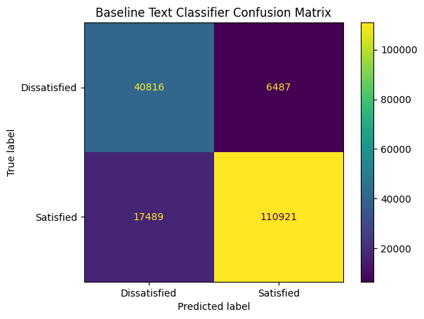
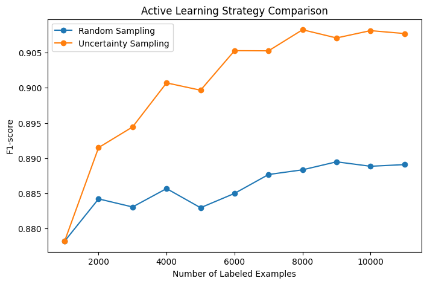
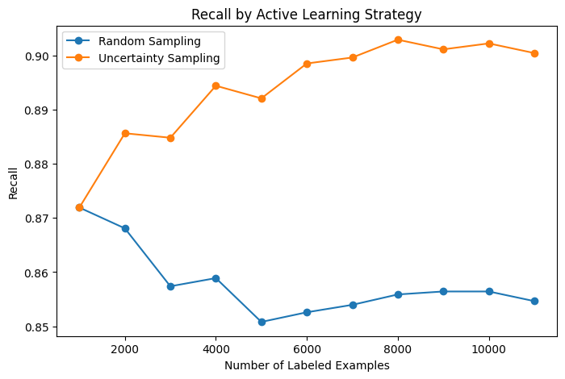
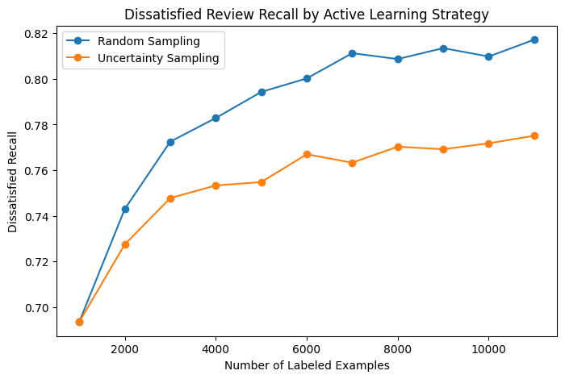

# Active-Learning-Review-Satisfication
NLP project using review text, transformer embeddings, and active learning to improve guest satisfaction classification with limited labeled data

## Overview

This project builds a text classification pipeline for predicting guest satisfaction from hotel review data. The goal is to simulate a real-world machine learning workflow where labeled data may be limited, expensive, or time-consuming to collect.

The project uses hotel review text and rating information to create a binary satisfaction label, trains a baseline text classifier, and compares two labeling strategies through an active learning simulation:

1. Random sampling
2. Uncertainty sampling

The main question is:

> Can active learning improve model performance by selecting more informative reviews for labeling compared with random sampling?

## Motivation

I built this project to strengthen my applied machine learning and data science skills in a hospitality and product-focused setting. Guest satisfaction modeling is a realistic problem because reviews contain valuable signals about service quality, cleanliness, value, location, rooms, and overall customer experience.

This project is also meant to go beyond a basic text classifier by exploring active learning, label efficiency, class-specific recall, and model evaluation tradeoffs.

## Dataset

This project uses a TripAdvisor hotel review dataset containing hotel reviews and rating information.

The dataset includes a `ratings` column stored as a string representation of a dictionary, with rating categories such as:

- service
- cleanliness
- overall
- value
- location
- sleep quality
- rooms

The `overall` rating was extracted from this dictionary-like field and used to create the target label.

### Label Definition

The target variable is `satisfaction_label`:

- `0` = Dissatisfied
- `1` = Satisfied

Ratings were converted into labels using:

```text
overall_rating < 4  → Dissatisfied
overall_rating >= 4 → Satisfied
```

### Dataset Note

The dataset is not included in this repository because the raw and processed files are too large for GitHub.

To run the notebook, download the hotel review CSV and place it in:

```text
data/raw/
```

The expected file path is:

```text
data/raw/trip_advisor_hotel_reviews.csv
```

## Tools Used

- Python
- Pandas
- NumPy
- Matplotlib
- Scikit-learn
- Jupyter Notebook
- Git / GitHub

## Project Workflow

1. Loaded and inspected the hotel review dataset
2. Parsed the nested `ratings` field to extract `overall_rating`
3. Created a binary satisfaction label from overall ratings
4. Cleaned review text by lowercasing and removing extra whitespace
5. Trained a baseline TF-IDF and Logistic Regression classifier
6. Evaluated the baseline model using precision, recall, F1-score, and a confusion matrix
7. Built an active learning simulation with random sampling and uncertainty sampling
8. Compared strategies across labeling rounds
9. Analyzed overall performance and class-specific recall tradeoffs

## Baseline Model

The baseline model used:

```text
TF-IDF text features + Logistic Regression
```

TF-IDF converted review text into numerical features, and Logistic Regression was used as an interpretable baseline classifier.

The baseline model achieved strong performance, showing that review text contains useful signals for satisfaction prediction.

## Active Learning Experiment

The active learning simulation started with a small labeled set and a larger unlabeled pool. At each round, the model selected more examples to label.

Two strategies were compared:

### Random Sampling

Random sampling selected new reviews randomly from the unlabeled pool.

### Uncertainty Sampling

Uncertainty sampling selected reviews where the model was least confident. For binary classification, this means selecting examples where the predicted probability was closest to `0.50`.

These examples are near the model's decision boundary and may be more informative for improving the model.

## Results Summary

The active learning experiment showed that uncertainty sampling and random sampling had different strengths.

Uncertainty sampling achieved stronger overall F1-score than random sampling, suggesting that uncertain examples helped improve general classification performance.

However, random sampling achieved stronger recall for the `Dissatisfied` class. This is an important result because dissatisfied reviews may be especially valuable in guest satisfaction analysis.

The key takeaway is that active learning strategy should be chosen based on the business goal and target metric.

## Visualizations

### Baseline Text Classifier Confusion Matrix



### Active Learning F1-score Comparison



### Active Learning Recall Comparison



### Dissatisfied Review Recall Comparison



## Key Takeaways

- Review text can be used to predict guest satisfaction with strong baseline performance.
- TF-IDF and Logistic Regression provide an interpretable starting point for text classification.
- Uncertainty sampling improved overall F1-score compared with random sampling.
- Random sampling performed better for dissatisfied review recall in this experiment.
- Class-specific metrics are important because aggregate metrics can hide meaningful tradeoffs.
- The best labeling strategy depends on the real-world goal of the model.

## Limitations

- The project uses a public review dataset and should be interpreted as a portfolio project, not a production guest satisfaction system.
- The satisfaction label is created from ratings, so it may not perfectly represent the full meaning of the review text.
- The model uses TF-IDF features rather than transformer-based embeddings.
- The active learning experiment is simulated using existing labels rather than a real human labeling workflow.
- The analysis does not yet include LLM-assisted labeling or label quality validation.

## Future Improvements

- Add transformer embeddings using SentenceTransformers
- Compare TF-IDF Logistic Regression with a neural model
- Add minority-aware uncertainty sampling to improve dissatisfied recall
- Simulate LLM-assisted labeling for uncertain reviews
- Add precision-recall curves and ROC/AUC analysis
- Build a Streamlit dashboard for exploring review predictions and active learning results
- Evaluate model performance across different hotel rating categories such as service, value, rooms, and cleanliness

## How to Run

1. Clone this repository:

```bash
git clone https://github.com/ElijahAmir08/Active-Learning-Review-Satisfication.git
```

2. Install required packages:

```bash
pip install -r requirements.txt
```

3. Download the dataset and place it in:

```text
data/raw/
```

4. Open and run the notebook:

```text
notebooks/review_satisfaction_analysis.ipynb
```

## Repository Structure

```text
Active-Learning-Review-Satisfication/
│
├── data/
│   ├── raw/
│   └── processed/
│
├── notebooks/
│   └── review_satisfaction_analysis.ipynb
│
├── src/
│
├── visuals/
│   ├── baseline_text_confusion_matrix.png
│   ├── active_learning_f1_comparison.png
│   ├── active_learning_recall_comparison.png
│   └── active_learning_dissatisfied_recall_comparison.png
│
├── README.md
├── requirements.txt
└── .gitignore
```
